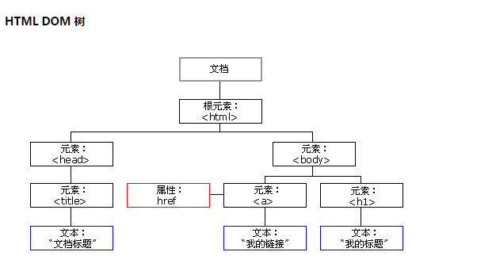
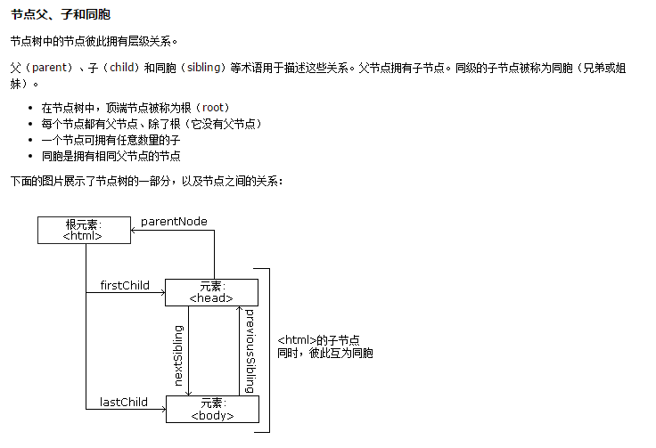

# 课程：JavaScript前端开发上
----
## 第一单元  变量、数据类型与表达式上
### 第一节课:  了解什么是JavaScript
<!-- 课程重难点
> * JavaScript的组成
> * JavaScript的重要性   -->

<!-- 课程内容   -->
> * 为什么要学习JavaScript?
> * 什么是JavaScript？
> * JavaScript的特点
> * 如何使用JavaScript

### 第二节课：了解JavaScript的基础语法
<!-- 课程内容 -->
> * 了解什么是标识符
> * 掌握标识符的语法，如：不能以数字开头，区分大小写等  
> * 了解代码中的注释作用及如何规范的添加注释
> * 了解代码中的语句及语句结尾分号的可选
> * 学习变量 —> 存储信息的"容器"

### 第三节课：掌握基础数据类型
<!-- 课程内容 -->
> * Number（数字类型）
> * String （字符串类型）
> * Boolean （布尔类型）
> * Undefined与Null
> * 掌握typeof操作获取变量的类型
> * 了解Array（数组类型）和Object（对象类型）    

介绍类型的时候注意，要先解释类型单词的英文释义

### 第四节课：基础算术表达式
<!-- 课程内容 -->
> * **+、—、*和/** 基本算术运算符
> * **%** 求余运算符
> * **!**  取反运算符
> * &&和|| 运算符

掌握如下类型判断
```js
typeof 0	//number
typeof '0'	//string
typeof !0	//boolean
```

---
## 第二单元 表达式下、运算符与简单的if语句
### 第一节课：表达式下
> * 基础类型转换
> * 掌握什么是表达式
> * 掌握运算操作符
	* 操作数个数
	* 操作数类型
	* 运算符的优先级
	* 运算符的结合
	* 运算顺序 -> 同级运算符自左向右依次执行

```js
// 掌握如下组合运算
1&&6+!2-3||5*4/5	=>3
// 执行顺序 ||>&&>(*、/)>!>(+、-)
```

### 第二节课：掌握关系表达式和赋值表达式
> * 相等 == 和 ===,返回值为boolean
> * 理解啥时候用全等判断，啥时候用相等判断
```js
true == 1	=> true 
true === 1	=> false
```
> * 不相等!== 和 !===,返回值为boolean
> * 理解啥时候用全不等判断，啥时候用不等判断
```js
false !== 1	=> false
false != 1	=> true
```
> * 简单赋值运算符‘=’,把等式右边的值赋给左边
```js
var a = 1;
var b = 2;
```
> * 复合赋值运算符，先计算等式右边的结果，再赋值给左边
```js
var a = 1*2+3;		=> a = 5
var b = true === 1;	=> b = false
```
### 第三节课：其他常用运算符
> * 条件运算符‘?’
> * 条件运算符的嵌套
```js
var a = false?2:3;			=>a = 3;
var b = true?false?true?100:50:0:-1;	=>b = 0
```
> * 逗号运算符‘,’,将若干表达式连接起来,注意优先级最低，必要时配合()操作符
```js
/*
逗号表达式：
	一般形式：表达式1，表达式2，表达式3，......表达式n
	求解过程：先计算表达式1的值，再计算表达式2的值，......一直计算到表达式n的值。最后整个表达式的值是表达式n的值。*/
var x;
x = (1,2,3); 			=>x = 3;
(x = 8*2, x*4) , x*2;		=>表达式 = 32
```

### 第四节课：常用系统弹框alert,prompt和confirm
> * 掌握什么是alert
> * 掌握什么是prompt
> * 掌握什么是confirm
> * 了解三种弹框的区别
> * 掌握prompt和confirm的返回值

```js
// alert
window.alert('我是alert弹框');

// confirm
// 点击确定时result为true, 点击取消result为false
var result = window.confirm('我是confirm弹框')

// prompt
// 点击确定时content为用户输入的手机号
var content = window.prompt('请输入你的手机号码');
```

---
## 第三单元 if语句的嵌套及switch语句
### 第一节课：if...else语句
	条件判断语句，如果条件为真则执行if后面块内的语句，条件为假则执行else后面块内的语句
```js
// if...else的嵌套
if (条件一){
	若条件一为真，则执行这里面的语句
}else if(条件二){
	若条件一为假且条件二为真，则执行这里面的语句
}else{
	若条件一为假且条件二也为假，则执行这里面的语句
}
```

### 第二节课：switch语句
	switch里的条件匹配后续哪一个case，就执行该case内的语句

```js
switch(条件){
	case 'case1': {case1的代码逻辑};break;
	case 'case2': {case2的代码逻辑};break;
	case 'case3': {case3的代码逻辑};break;
	default: {都没匹配到时的代码逻辑}
}
```

### 第三节课：if...else, switch语句的综合应用：计算器
```js
var	num1 = 1,  
	num2 = 2,
	result;
var operation = '+';
// if...else的实现
if (operation == '+'){
	result = num1 + num2;
}else if(operation == '-'){
	result = num1 - num2;
}else if(operation == '*'){
	result = num1 * num2;
}else{
	result = num1/num2;
}
//switch...case的实现
switch(operation){
	case '+': result = num1 + num2;break;
	case '-': result = num1 - num2;break;
	case '*': result = num1 * num2;break;
	default: result = num1/num2
}
console.log('result...', result);
```

### 第四节课：逻辑操作符与、或、非
> * 逻辑表达式非 ！, 取反操作，返回boolean值
```js
// 首先会对操作数隐式转化为boolean值，再做取反操作
// 取反值为false的情况
!true => false
!1 => false
!'123' => false
// 取反值为true的情况
!false => true
!0 => true
!'' => true
```
> * 逻辑与表达式 &&, 与表达式连用的返回值
```js
1 && 2 && 3 && 4 => 返回值4
遇到第一个false的值直接返回该值，或直到表达式结尾返回结尾的值
```
> * 逻辑或表达 ||，或表达式连用的返回值
```js
1 || 2 || 3 || 4 => 返回值1
遇到第一个非false的值就返回该值，或知道表达式结尾返回结尾的值
```

---
## 第四单元 循环语句
### 第一节课：认识循环
> * 为什么要学习循环？
> * 什么是循环？
> * 循环的几个要素
	* 起始条件, 一般从0开始
	* 终止条件
	* 循环条件
	* 循环体
	* 循环次数

### 第二节课：循环中的for语句
> * for循环的使用
> * for循环的嵌套
> * for循环中的无限循环
```js
// 输出9*9乘法表
for (var i=1;i<10;i++){
	var str = '';
	for (var j=1;j<=i;j++){
		str += i+' * '+j+' = '+i*j+'  ';
		if (i*j<10){
			str += ' ';
		}
	}
	console.log(str);
}
```

### 第三节课：循环中的while语句
> * while循环的使用
> * while循环的嵌套
> * while循环的无限循环
> * do...while循环
> * do...while循环必须执行一次的问题
```js
var i=1;
while(i<=10){
	console.log(i);
	i++;
}
```

### 第四节课：break和continue
> * 跳出当前循环，不再执行循环操作用break
> * 跳过当前循环，执行下一条循环用continue

```js
/* 0到10的叠加，在5的时候分别break和continue */
// break sum=10
var sum = 0;
for (var i=0;i<=10;i++){
	if (i==5){
		break;
	}
	sum += i;
}

// continue	sum=50
var sum = 0;
for (var i=0;i<=10;i++){
	if (i==5){
		continue;
	}
	sum += i;
}
```

---
## 第五单元 函数
### 第一节课：初识函数
> * 为什么要使用函数？
> * 什么是函数？
> * 函数的命名
> * 函数的声明和函数表达式的写法及区别

### 第二节课：函数的定义
> * 函数的参数？
	* 形参
	* 实参
	* arguments
> * 函数的返回值
> * return 语句

### 第三节课：函数的调用与自执行函数
> * 函数的调用，如：func()
> * 函数的重载
> * 匿名函数
> * 匿名函数的自执行用法

### 第四节课：函数作用域
> * 函数内部变量的区别
> * 全局变量与局部变量的区别
> * 函数的闭包
> * 闭包函数的意义及用途
---

## 第六单元 String与Number
### 第一节课：字符串创建
> * 什么是字符串
> * String对象
> * 创建字符串的几种方式
> * length属性

### 第二节课：字符串查找
> * charAt()
> * indexOf()
> * lastIndexOf()
> * match()

### 第三节课：字符串操作方法
> * replace()
> * substr()
> * slice()
> * substring()
> * toUpperCase()
> * toLowerCase()

### 第四节课:Math对象的常用方法
> * Math.ceil()
> * Math.floor()
> * Math.round()
> * Math.min()
> * Math.max()
> * Math.abs()
> * Math.random()

```js
// 利用Math.random实现抽奖案例中的随机抽取逻辑
// 从1到10中随机抽取一位数
   var lucky = Math.floor(Math.random()*10+1)
```

---
## 第七单元 数组
### 第一节课：数组简介
> * 案例引入+问题思考：为什么要学习数组
> * 种差加属定义什么是数组
> * 对比变量和函数，外延二维三维数组
> * 介绍数组追加元素方法push  

#### 去重流程图
```flow
```
	
### 第二节课：数组的添加和删除	
> * 栈的概念： 介绍push和pop方法，
> * 队列的概念：介绍shift和unshift方法
> * 案例：从数组中选取若干数量元素，**保证元素不重复**
> * 埋坑：选取后删除元素，引出splice方法


#### 案例流程图
```flow
st=>start: 创建新数组
op1=>operation: 迭代需要选取的元素数量
op2=>operation: 生成随机下标，选取元素添加到新数组
op3=>operation: 从老数组删除该元素（学生容易忘记的点）
e=>end

st->op1->op2->op3->e
```
#### 案例代码
```js
// 从数组中选取若干元素
var arr = [1,2,3,4,5,6,7,8,9,10];
function uniqItem(num){
	var newArr = [];
	for (var i=0;i<num;i++){
		var index = Math.floor(Math.random(0, 1)*arr.length)
		newArr.push(arr[index]);
		// 这里注意，如果每次取出数组后不删除后出现重复
		// arr.splice(index,1);
	}
	return newArr;
}
//调用
uniqItem(5);
```
	
### 第三节课：数组丰富的API
> * concat,	数组连接
> * join,	数组连接
> * reverse，数组反序
> * sort, 	数组排序，外延数组对象的排序
> * slice,  数组切片
> * 认识伪数组
	* arguments
	* document.querySelectAll()

介绍的时候注意，要先解释数组API单词的**英文释义**

### 第四节课：数组的应用
> * 数组的遍历：forEach、for循环、for...in、map
> * 复杂数组：二维数组和对象数组
> * 二维数组的应用： 打印班级同学名单，
> * 对象数组的应用： 排序城市数据，按照首字母对城市数据做升序排序

#### 城市数据如下
```js 
[{"CityID":"910","CityName":"保定","EngName":"baoding","ParentID":"9"},    
{"CityID":"909","CityName":"沧州","EngName":"cangzhou","ParentID":"9"},  
{"CityID":"912","CityName":"承德","EngName":"chengde","ParentID":"9"},  
{"CityID":"907","CityName":"邯郸","EngName":"handan","ParentID":"9"},  
{"CityID":"908","CityName":"衡水","EngName":"hengshui","ParentID":"9"},  
{"CityID":"906","CityName":"廊坊","EngName":"langfang","ParentID":"9"},  
{"CityID":"905","CityName":"秦皇岛","EngName":"qinhuangdao","ParentID":"9"},  
{"CityID":"901","CityName":"石家庄","EngName":"shijiazhuang","ParentID":"9"}, 
{"CityID":"902","CityName":"唐山","EngName":"tangshan","ParentID":"9"},  
{"CityID":"903","CityName":"邢台","EngName":"xingtai","ParentID":"9"},  
{"CityID":"911","CityName":"张家口","EngName":"zhangjiakou","ParentID":"9"}]
```

## 第八单元 数组的综合应用
### 第一节课：数组查找和翻转
> * indexOf
> * lastIndexOf

### 第二节课：数组排序一
> * 冒泡排序
> * 选择排序
> * 插入排序

### 第三节课：数组排序二
> * 快速排序
> * 原生sort排序
> * 各排序之间的简单对比

### 第四节课：数组迭代方法
> * forEach 
> * map
> * filter
> * some
> * every
---

## 第九单元 日期和时间
### 第一节课：认识日期对象
> * 什么是日期对象？
> * 创建日期对象
	* new Date()
	* new Date(milliseconds)
	* new Date(year, month, day, hours, minutes, seconds, milliseconds)
> * 时间戳的概念, 注意时间戳的最小单位，js是到毫秒，大多数服务端脚本是精确到秒
> * 隐式转换， 比如+、-可以直接把时间对象转为number
```js
	// 直接把日期对象转化为时间戳
	+ new Date();
```

### 第二节课：日期对象继承对象的方法
> * toLocaleString()
> * toString
> * valueof
> * setTimeout
> * setInterval

### 第三节课：日期的方法一
> * getFullYear()
> * setFullYear()
> * getFullMonth()
> * setFullMonth()
> * getDate()
> * setDate()
> * getDay()
> * setDay()

### 第四节课：日期的方法二
> * getTime()
> * setTime()
> * getHours()
> * setHours()
> * getMinutes()
> * setMinutes()
> * getSeconds()
> * setSeconds()
> * getMillSeconds()
> * setMillSeconds()

```js
// 案例：格式化当前时间 YYYY-MM-DD HH:MM:SS
var date = new Date();
var year = date.getFullYear(),
	month = date.getMonth()+1,
	day = date.getDate(),
	hour = date.getHours(),
	min = date.getMinutes(),
	sec = date.getSeconds();
	month<10?month='0'+month:null;
	day<10?day='0'+day:null;
	hour<10?hour='0'+hour:null;
	min<10?min='0'+min:null;
	sec<10?sec='0'+sec:null;
	console.log('YYYY-MM-DD HH:MM:SS', year+'-'+month+'-'+day+' '+hour+':'+min+':'+sec);

// 案例：日期比较, 先转化为时间戳再进行比较
var date1 = new Date();
var date2 = new Date(2018, 09, 09, 09, 09, 09);
	date1 = +date1;
	date2 = +date2;
	return date1>date2?'大于':'小于或等于'
```

---
## 第十单元 单元DOM基础与事件基础
### 第一节课：节点和节点层次关系
> * dom树的概念

> * dom节点的概念
> * dom节点的分类
> * dom节点间的关系
	* 父子节点
	* 兄弟节点
	* 后代节点


### 第二节课：查找结点方式
> * 返回值为单一dom的
	* getElementById()
	* querySelector()
> * 返回值为dom数组的
	* getElementsByTagName()
	* getElementsByName()
	* getElementsByClassName()
	* querySelectorAll()
> * 伪数组的概念

### 第三节课：节点属性一
> * nodeName
> * nodeValue
> * nodeType, 常见的1，2，3
	* 1为元素
	* 2为属性名称
	* 3为文本

```js
// nodeType示例
var p = document.createElement('p');
	p.className = 'active';
	p.innerText = 'nodeType示例';

	p.nodeType = 1;
	p.attributes.class.nodeType = 2;
	p.childNodes[0].nodeType = 3;
```

### 第四节课：节点属性二
> * firstChild
> * lastChild
> * parentNode
> * childNodes
```js
// 结合组件间元素关系，实现组件父子元素和兄弟元素的获取
```
---

## 第十一单元：css属性与HTML属性操作
### 第一节课：行内样式与class类样式
> * element.style属性
> * element.style.cssText属性
> * element.className属性, 可以直接修改class
> * element.classList
	* add()		增加class类
	* remove()  移除class类
> * 样式的优先级
	* !important
	* 行内样式大于class类样式
	* id>class>tag

### 第二节课：元素属性
> * element.attributes属性
> * element.getAttribute()
> * element.setAttribute()
> * element.removeAttribute()

### 第三节课：DOM事件处理程序
> * DOM0级事件处理
	* 标签内写onclick事件
	* js中绑定onclick事件
> * DOM2级事件处理
	* 事件捕获和冒泡
	* DOM事件流
	* chrome下的：addEventListener,removeEventListener
	* ie下的：attachEvent,detachEvent 

### 第四节课：文档写入与插入标记
> *  document.write
	* 插入文本
	* 插入标签
> * element.innerHTML
> * element.innerText
> * element.innerHTML与element.innerText的区别与联系
	* innerHTML既能插入标签也能插入文本
	* innerText只能插入文本，标签会被解析为文本
---
## 第十二单元：DOM树与节点方法
### 第一节课：创建节点的方法
> * 创建文本节点： creareText
> * 创建元素节点： createElement
	* link元素
	* script元素
	* img元素
	* 普通元素

```js
// 图片懒加载
var img = document.createElement('img');
img.onload = function(){
	document.body.append(im);
}
img.src = '图片地址';
```
### 第二节课：节点的追加与替换
> * appendChild()
> * insertChild()
> * replaceChild()

### 第三节课：节点的遍历
> * 获取节点列表的DOM操作
	* getElementsByTagName()
	* getElementsByName()
	* getElementsByClassName()
	* querySelectorAll()
> * 获取节点列表的length属性
> * 使用for循环遍历节点列表，获取每一个节点

### 第四节课：删除节点
> * 删除普通节点removeChild()
> * 删除文本节点，需要判断nodeType==3

```js
function deleteSpace(node){
	var childs = node.childNodes;
	for(var i = 0;i < childs.length;i ++){
		if(childs[i].nodeType === 3 && /^\s+$/.test(childs[i].nodeValue)){
			node.removeChild(childs[i]);
		}
	}
	return node;
}
```
---